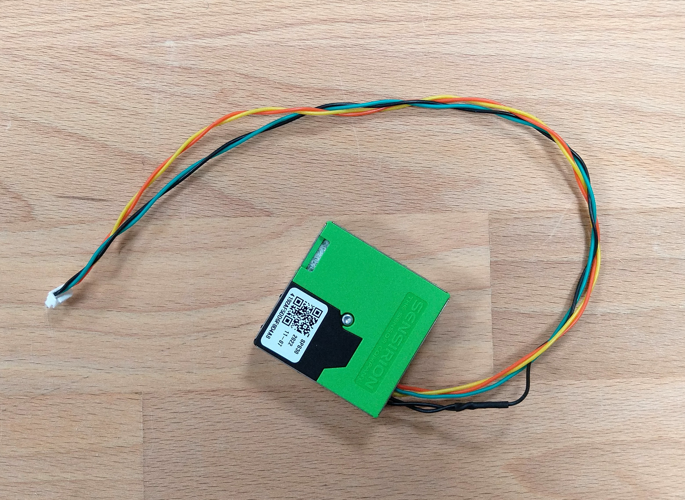
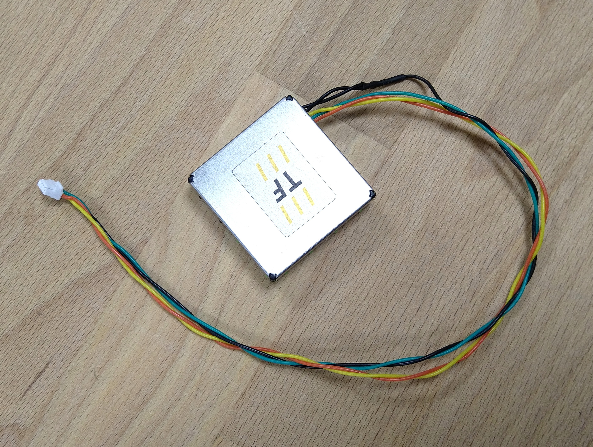

# TFPM02A - Particulate Matter Sensor for ThunderFly TF-ATMON system

[Particulate matter](https://en.wikipedia.org/wiki/Particulates) sensor for [TF-ATMON system](https://github.com/ThunderFly-aerospace/TF-ATMON) is based on [Sensirion SPS30](https://sensirion.com/products/catalog/SPS30/), [TFGPS01](https://github.com/ThunderFly-aerospace/TFGPS01) and PX4 autopilot firmware with suitable driver. The PX4 driver emits uOrb messages which are translated to [MAVLink](https://en.wikipedia.org/wiki/MAVLink) messages ready to log onboard and transmit to [TF-ATMON enabled GCS](https://github.com/ThunderFly-aerospace/TF-GCS01). 

Look to the following video for a demonstration flight of a sensor mounted on [TF-G2 autogyro](https://github.com/ThunderFly-aerospace/TF-G2). 

The modified [SPS30](https://sensirion.com/products/catalog/SPS30/) sensor is directly connected to the PX4 autopilot supported hardware by using ZHR-5 to JST-GH cable. 

