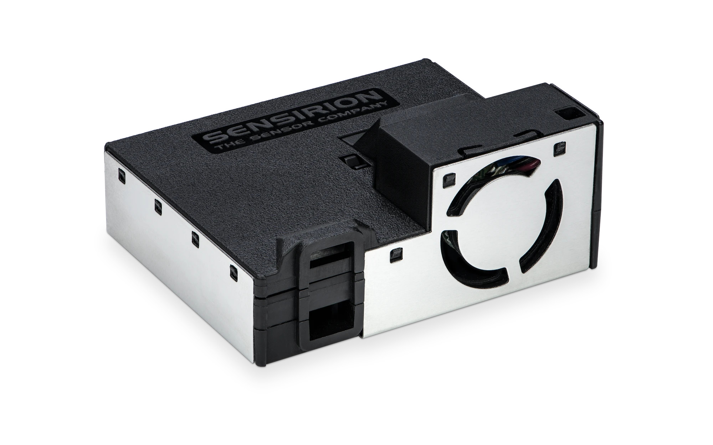

# TFPM02B - Particulate Matter Sensor for ThunderFly TF-ATMON system

[Particulate matter](https://en.wikipedia.org/wiki/Particulates) sensor for [TF-ATMON system](https://github.com/ThunderFly-aerospace/TF-ATMON) is based on [Sensirion SPS5x](https://sensirion.com/products/catalog/SEN54/), [TFGPS01](https://github.com/ThunderFly-aerospace/TFGPS01) and PX4 autopilot firmware with suitable driver. The PX4 driver emits uOrb messages which are translated to [MAVLink](https://en.wikipedia.org/wiki/MAVLink) messages ready to log onboard and transmit to [TF-ATMON enabled GCS](https://github.com/ThunderFly-aerospace/TF-GCS01). 

Look to the following video for a demonstration flight of a sensor mounted on [TF-G2 autogyro](https://github.com/ThunderFly-aerospace/TF-G2). 

The [SEN5x](https://sensirion.com/products/catalog/SEN54/) sensor is directly connected to the I²C bus on PX4 autopilot supported hardware by using JST-GH cable.  

## The main features

 - Particulate matter sensing PM1.0, PM2.5, PM4 and PM10 in range 0 - 1000 μg/m³ (Accuracy ±10 %)
 - Humidity sensing 0 - 90 %RH (Accuracy ±4.5 %RH)
 - Temperature measurement -10 to 50 °C (Accuracy 0.45 °C)
 - [VOC](https://en.wikipedia.org/wiki/Volatile_organic_compound) in 0-500 VOC Index corresponds to range 0 - 1000 ppm ethanol equivalent. 

Unfortunatelly the sensor does not output number concentrations, for that values use the TFPM02A variant.
